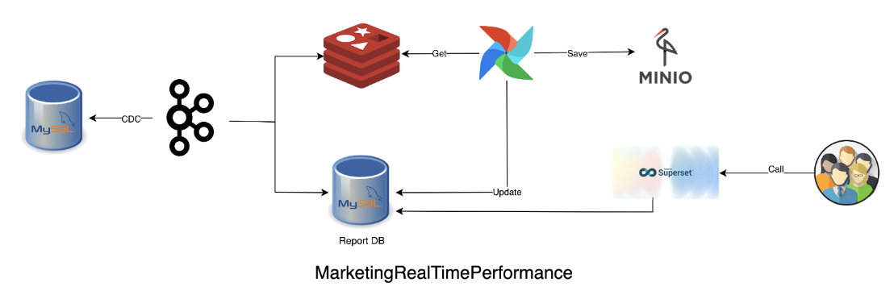

# Marketing Real Time Performance

The Data Engineer team is required to build a real-time help desk report on the company's data scientifically and effectively. Then use the skills to develop an application base on the data.

In the Maven Sales challenge, Team DE will take on the role of a BI Developer for MavenTech, a company that sells computer hardware to large enterprises. They have been using a new CRM system to track sales opportunities but have no overview of the data outside of this platform.

Team DE was asked to create an interactive dashboard that would help sales managers track real-time performance (within 24 hours) based on their team's data.

## Project Overview and Architecture

<div style="text-align: center">
    
</div>

**1- Python:**

In this project, [Python](https://www.python.org/) served as the primary programming language. Python is widely used in data engineering projects due to its versatility, extensive libraries, and ease of use.

**2- Apache Airflow:**
[Apache Airflow](https://airflow.apache.org/) played a crucial role in this project by enabling the creation of Directed Acyclic Graphs (DAGs) and facilitating scheduling for data simulation tasks. As an open-source platform, Apache Airflow excels in orchestrating complex workflows and data pipelines. By defining DAGs, which encapsulate the sequence of tasks and their dependencies, I could automate the process of simulating data and executing tasks reliably and at scale. Leveraging Airflow's scheduling capabilities, I ensured efficient management of data processing tasks, ensuring timely execution and handling of dependencies between different components of the pipeline.

**3- MySQL:**
[MySQL](https://www.mysql.com/) served as the Online Transaction Processing (OLTP) database for this project, tasked with storing transactional data. To begin, I meticulously crafted a database schema, which was then implemented within MySQL. Connectivity to MySQL was established using the mysql-connector-python library, a robust MySQL adapter for Python. An accompanying entity relationship diagram (ERD) is provided below, offering a visual representation of the database schema.

**4- Debezium and Apache Kafka:**
[Debezium](https://debezium.io/), utilized as a [Kafka](https://kafka.apache.org/) source connector in this project, plays a pivotal role in enabling Change Data Capture (CDC) from MySQL to Apache Kafka. Acting as a conduit for real-time streaming, Debezium captures database changes in MySQL and efficiently transfers them to Kafka topics. This seamless integration ensures that Kafka consumers have access to the most up-to-date information for further processing and analysis within the data pipeline. By leveraging Kafka's distributed architecture, the combined functionality of Debezium and Kafka facilitates scalable and fault-tolerant streaming of data, empowering the project with robust real-time capabilities.

**5- Redis:**
[Redis](https://redis.io/) to store Change Data Capture (CDC) data. Redis is an in-memory NoSQL database that allows us to process and retrieve data quickly, while also supporting real-time data management.

**6- MinIO:**
[MinIO](https://min.io/) utilized as a long-term storage solution for the Change Data Capture (CDC) data that we transfer from Redis. MinIO is an open-source object storage server that is compatible with Amazon S3 APIs, making it an excellent choice for scalable storage. MinIO allows you to store vast amounts of data in a cost-effective manner.

**7- Superset:**
[Superset](https://superset.apache.org/) utilized as our data visualization tool to create interactive dashboards and gain insights from the data captured through Change Data Capture (CDC). Superset is a modern data exploration and visualization platform that allows users to create charts, dashboards, and data applications quickly.

**8- Docker (docker-compose):**
[docker-compose](https://docs.docker.com/compose/) to streamline the deployment and interconnection of various services essential for the project's functionality. The configuration defines a comprehensive suite of 13 services, encompassing "airflow," "kafka-broker," "zookeeper,", "debezium," "superset," and others. Notably, the "airflow" service orchestrates workflow management, while "kafka-broker" and "zookeeper" handle Kafka messaging infrastructure. The "debezium" enabling Change Data Capture (CDC) from MySQL to Kafka. Superset is deployed for monitoring and visualization purposes. Each service is meticulously configured with relevant environment variables, port assignments, health checks, and dependencies, ensuring seamless integration within the stack. Furthermore, volumes are employed to persist data for services such as Kafka, Superset, and MySQL. A dedicated network ("services") facilitates efficient communication among the deployed services. This docker-compose configuration optimizes the management of the project's tech stack, fostering streamlined development, deployment, and operation processes.

---

## Geting Started: Running the Project

#### Prerequisites:

- Ensure you have Docker and docker-compose installed on your system. If not, please follow the official [Docker](https://docs.docker.com/) installation guide for your operating system.

### Step 1: Clone the Repository

1. Open the terminal
2. Clone the project repository from GitHub to your local machine using the following command:

```terminal
    git clone https://github.com/hieund1901/maven_sales.git
```

### Step 2: Navigate to Project Directory

Use the command line to navigate to the root directory of the project:

```terminal
    cd maven-sales
```

### Step 3: Start Docker Conatiners

Execute the following command to start all services defined in the docker-compose folder:

```terminal
    cd docker-compose
    ./run.sh
```

This command will build and start the Docker containers for various services in your project.

### Step 4: Access Project Services

Open a web browser and navigate to the following URLs to access various project services:

- **Kafka UI:** `http://localhost:8090/`
- **MinIO:** `http://localhost:9000/`
- **Airflow UI:** `http://localhost:8080/`
- **Superset:** `http://localhost:8088/`
- **MySQL:** `http://localhost:3306`
